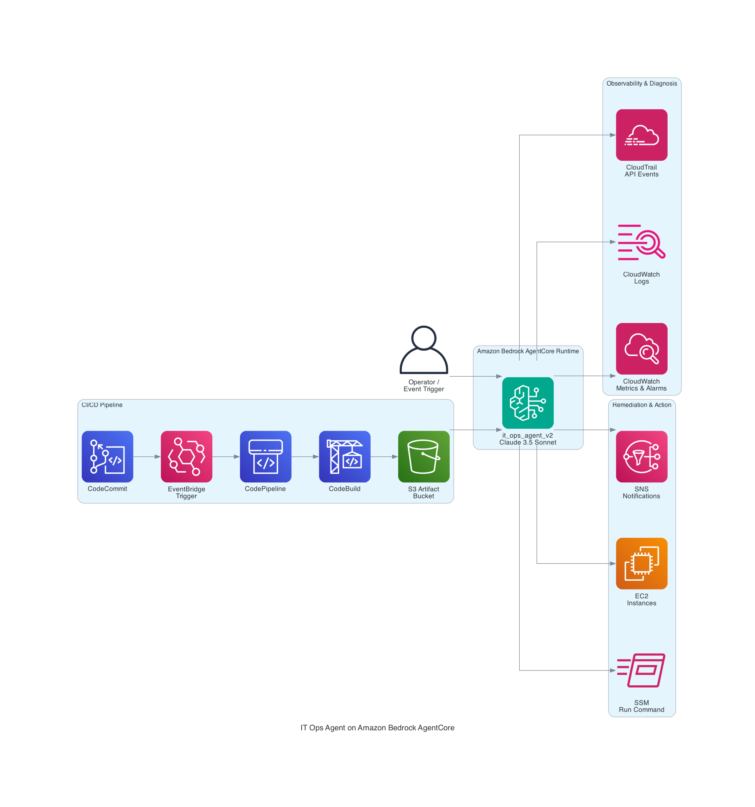

# How I Built an IT Operations Agent That Actually Fixes Things (Not Just Reports Them)

> **Level**: 300 (Advanced) | **Services**: Amazon Bedrock AgentCore, CloudWatch, SSM, EC2, CodePipeline, CodeBuild  
> **Time to Build**: 4-6 hours | **Region**: us-east-1

---

## The Problem That Kept Me Up at Night

I manage infrastructure for a growing team, and honestly, I was drowning. Every morning started the same way — wake up, check Slack, find 15 CloudWatch alarms fired overnight, spend 2 hours figuring out what went wrong, SSH into boxes, restart services, and pray it doesn't happen again.

The worst part? 80% of these incidents followed the same pattern. High memory? Find the runaway process, kill it, restart the service. Disk full? Clear old logs. CPU spike after a deployment? Roll it back. I was basically a human runbook executor.

So I thought — what if I could build an agent that doesn't just *tell* me something is wrong (I have CloudWatch for that), but actually *investigates* the issue and *fixes* it? That's how **it_ops_agent_v2** was born.

---

## What I Built

My IT Ops Agent runs on **Amazon Bedrock AgentCore Runtime** and it can:

- 🔍 **Diagnose** — Pulls CloudWatch metrics, searches logs, checks CloudTrail for who changed what
- 🔧 **Fix** — Runs SSM commands on instances, reboots boxes, manages security groups
- 📢 **Alert** — Sends SNS notifications to my team with what it found and what it did
- 📖 **Learn** — Queries our internal runbook Knowledge Base for SOPs before acting

It's been running since March 2026. I've iterated through **6 versions** in production, and I deploy updates with a simple `git push`. Let me show you how I built it.

---

## Architecture — How It All Fits Together



Here's the high-level view of what I ended up with:

```
┌─────────────────────────────────────────────────────────────────────┐
│                    My IT Ops Agent Architecture                       │
├─────────────────────────────────────────────────────────────────────┤
│                                                                       │
│  ┌──────────────┐     ┌─────────────────────────────────────┐       │
│  │  Me / Alarm  │     │   Amazon Bedrock AgentCore Runtime   │       │
│  │  / Event     │────▶│                                     │       │
│  │  Trigger     │     │   ┌─────────────────────────────┐   │       │
│  └──────────────┘     │   │     it_ops_agent_v2         │   │       │
│                        │   │   (Strands + Claude 3.5)    │   │       │
│                        │   └─────────────────────────────┘   │       │
│                        └─────────────────────────────────────┘       │
│                                     │                                 │
│  ┌──────────────────────────────────┼────────────────────────────┐   │
│  │  What it talks to:              │                             │   │
│  │                                  ▼                             │   │
│  │  CloudWatch ─ CloudTrail ─ SSM ─ EC2 ─ SNS ─ EKS ─ KB       │   │
│  └───────────────────────────────────────────────────────────────┘   │
│                                                                       │
│  ┌───────────────────────────────────────────────────────────────┐   │
│  │  CI/CD: CodeCommit → CodeBuild → S3 → AgentCore Update       │   │
│  └───────────────────────────────────────────────────────────────┘   │
└─────────────────────────────────────────────────────────────────────┘
```

### Why I Made These Choices

**Why AgentCore Runtime instead of Lambda?**  
My debugging sessions are conversational. I ask the agent "what's wrong?", it investigates, I say "fix it", it does. That multi-turn flow needs session persistence. AgentCore gives me up to 8 hours per session with a 15-minute idle timeout. Lambda would've been a nightmare for this.

**Why Strands Agent Framework?**  
I tried building raw tool-calling logic myself. Don't. Strands handles the tool loop cleanly — I just define tools as Python functions and the framework handles routing, retries, and the conversation flow with Claude.

**Why PUBLIC network mode?**  
I know, I know — "private is safer." But for my use case, IAM authentication secures the endpoint, and I didn't want to deal with VPC configurations slowing me down. I can always tighten this later.

---

## What You'll Need Before Starting

| Requirement | Why |
|-------------|-----|
| AWS Account with Bedrock access | Claude 3.5 Sonnet v2 must be enabled |
| AgentCore Runtime access | It's in the Bedrock console |
| Python 3.12+ | For the agent code |
| AWS CLI v2 | For deploying |
| An S3 bucket | I used `event-agent-kb-<account-id>` |
| Some EC2 instances to manage | So the agent has something to work with |

> 📸 **Screenshot Placeholder**: AgentCore Runtime Dashboard  
>   
> *My runtime list showing it_ops_agent_v2 at version 6, status READY*

---

## Setting Up IAM (The Boring But Critical Part)

First thing — the agent needs permissions to actually *do stuff*. I spent more time on IAM than I'd like to admit. Here's what I landed on.

### The Trust Policy

AgentCore needs to assume your role. I also added `bedrock.amazonaws.com` and `ec2.amazonaws.com` because my agent calls Bedrock models and sometimes needs EC2 context.

```json
{
  "Version": "2012-10-17",
  "Statement": [
    {
      "Effect": "Allow",
      "Principal": {
        "Service": [
          "bedrock-agentcore.amazonaws.com",
          "bedrock.amazonaws.com",
          "ec2.amazonaws.com"
        ]
      },
      "Action": "sts:AssumeRole"
    },
    {
      "Effect": "Allow",
      "Principal": { "AWS": "arn:aws:iam::<YOUR_ACCOUNT_ID>:root" },
      "Action": "sts:AssumeRole"
    }
  ]
}
```

```bash
aws iam create-role \
  --role-name it-ops-agent-role \
  --assume-role-policy-document file://trust-policy.json
```

### The Permissions (I Use Separate Policies for Each Concern)

**Lesson I learned the hard way**: Don't dump everything into one giant policy. When something breaks, you want to know which permission is missing without reading 200 lines of JSON.

#### Policy 1: Bedrock Access (so the agent can think)

```json
{
  "Version": "2012-10-17",
  "Statement": [
    {
      "Sid": "BedrockModelAccess",
      "Effect": "Allow",
      "Action": ["bedrock:InvokeModel", "bedrock:InvokeModelWithResponseStream"],
      "Resource": "*"
    },
    {
      "Sid": "KnowledgeBaseAccess",
      "Effect": "Allow",
      "Action": ["bedrock:Retrieve", "bedrock:RetrieveAndGenerate"],
      "Resource": "arn:aws:bedrock:us-east-1:<ACCOUNT_ID>:knowledge-base/<KB_ID>"
    },
    {
      "Sid": "AgentCoreAccess",
      "Effect": "Allow",
      "Action": "bedrock-agentcore:*",
      "Resource": "*"
    }
  ]
}
```

#### Policy 2: Observability (so it can diagnose)

```json
{
  "Version": "2012-10-17",
  "Statement": [
    {
      "Sid": "CloudWatchReadForRCA",
      "Effect": "Allow",
      "Action": [
        "cloudwatch:DescribeAlarms", "cloudwatch:GetMetricStatistics",
        "cloudwatch:GetMetricData", "cloudwatch:ListMetrics"
      ],
      "Resource": "*"
    },
    {
      "Sid": "CloudWatchLogsForRCA",
      "Effect": "Allow",
      "Action": [
        "logs:FilterLogEvents", "logs:GetLogEvents",
        "logs:DescribeLogGroups", "logs:DescribeLogStreams"
      ],
      "Resource": "*"
    },
    {
      "Sid": "CloudTrailForRCA",
      "Effect": "Allow",
      "Action": ["cloudtrail:LookupEvents", "cloudtrail:GetTrailStatus"],
      "Resource": "*"
    }
  ]
}
```

#### Policy 3: Remediation (so it can actually fix things)

This is the scary one. I was nervous giving an AI agent `ec2:RebootInstances` and `ssm:SendCommand`. But that's the whole point — and the system prompt constrains when it uses these.

```json
{
  "Version": "2012-10-17",
  "Statement": [
    {
      "Sid": "SSMFull",
      "Effect": "Allow",
      "Action": [
        "ssm:SendCommand", "ssm:GetCommandInvocation",
        "ssm:ListCommandInvocations", "ssm:DescribeInstanceInformation",
        "ssm:ListCommands", "ssm:CancelCommand"
      ],
      "Resource": "*"
    },
    {
      "Sid": "EC2Ops",
      "Effect": "Allow",
      "Action": [
        "ec2:RebootInstances", "ec2:StartInstances", "ec2:StopInstances",
        "ec2:DescribeInstances", "ec2:DescribeInstanceStatus",
        "ec2:ModifyInstanceAttribute", "ec2:CreateTags"
      ],
      "Resource": "*"
    },
    {
      "Sid": "SNSOps",
      "Effect": "Allow",
      "Action": ["sns:Publish", "sns:ListTopics", "sns:CreateTopic", "sns:Subscribe"],
      "Resource": "*"
    }
  ]
}
```

> 📸 **Screenshot Placeholder**: IAM Role Permissions  
>   
> *All my inline policies — I ended up with 8 of them as the agent grew*

> 📸 **Screenshot Placeholder**: Trust Relationships  
>   
> *bedrock-agentcore.amazonaws.com as trusted entity*

---

## Writing the Agent Code

This is where it gets fun. My project structure looks like this:

```
it-ops-agent/
├── main.py            # HTTP server (AgentCore calls this)
├── agent.py           # Agent brain — system prompt + tools
├── tools/
│   ├── cloudwatch_tools.py
│   ├── ssm_tools.py
│   ├── ec2_tools.py
│   ├── log_tools.py
│   ├── sns_tools.py
│   └── kb_tools.py
├── requirements.txt
└── buildspec.yml      # CI/CD (more on this later)
```

### `main.py` — The Entry Point

AgentCore Runtime expects an HTTP server on port 8080. When someone invokes my agent, AgentCore sends a POST request to this server. Simple as that.

```python
import json
import logging
from http.server import HTTPServer, BaseHTTPRequestHandler
from agent import create_it_ops_agent

logging.basicConfig(level=logging.INFO)
logger = logging.getLogger(__name__)

agent = create_it_ops_agent()


class AgentHandler(BaseHTTPRequestHandler):
    def do_POST(self):
        content_length = int(self.headers.get("Content-Length", 0))
        body = self.rfile.read(content_length)
        try:
            request = json.loads(body)
            prompt = request.get("prompt", "")
            session_id = request.get("session_id", "default")
            logger.info(f"Session {session_id}: {prompt[:100]}...")

            response = agent(prompt)

            self.send_response(200)
            self.send_header("Content-Type", "application/json")
            self.end_headers()
            self.wfile.write(json.dumps({
                "response": str(response),
                "session_id": session_id,
                "status": "success"
            }).encode())
        except Exception as e:
            logger.error(f"Agent error: {e}", exc_info=True)
            self.send_response(500)
            self.send_header("Content-Type", "application/json")
            self.end_headers()
            self.wfile.write(json.dumps({"error": str(e)}).encode())

    def do_GET(self):
        """Health check — AgentCore pings this."""
        self.send_response(200)
        self.send_header("Content-Type", "application/json")
        self.end_headers()
        self.wfile.write(json.dumps({"status": "healthy"}).encode())


if __name__ == "__main__":
    server = HTTPServer(("0.0.0.0", 8080), AgentHandler)
    logger.info("IT Ops Agent starting on port 8080")
    server.serve_forever()
```

### `agent.py` — The Brain

The system prompt is everything. I spent more time iterating on this than on the actual tools. The key insight: **tell the agent to diagnose BEFORE it remediates**. Without this, it'll happily reboot your instance without checking if that's actually the problem.

```python
from strands import Agent
from strands.models import BedrockModel
from tools.cloudwatch_tools import get_alarms, get_metric_data
from tools.ssm_tools import run_ssm_command, check_ssm_status
from tools.ec2_tools import manage_instance, describe_instances
from tools.log_tools import search_logs, get_recent_errors
from tools.sns_tools import send_notification
from tools.kb_tools import query_runbook

SYSTEM_PROMPT = """You are my IT Operations Agent. You monitor, diagnose, 
and fix infrastructure issues on AWS.

## What You Can Do:
1. Query CloudWatch metrics/alarms and search logs
2. Check CloudTrail for who changed what recently
3. Run commands on instances via SSM
4. Reboot/stop/start EC2 instances
5. Send alerts to our team via SNS
6. Look up our runbooks in the Knowledge Base

## Rules (IMPORTANT):
- ALWAYS diagnose before fixing. Don't reboot just because CPU is high.
- Explain what you found and what you're about to do.
- For destructive actions (reboot, stop), state WHY you're doing it.
- After fixing, VERIFY the fix worked.
- If you're not sure what to do, say so. Don't guess.
"""


def create_it_ops_agent() -> Agent:
    model = BedrockModel(
        model_id="anthropic.claude-3-5-sonnet-20241022-v2:0",
        region_name="us-east-1"
    )
    return Agent(
        model=model,
        system_prompt=SYSTEM_PROMPT,
        tools=[
            get_alarms, get_metric_data, run_ssm_command, check_ssm_status,
            manage_instance, describe_instances, search_logs, get_recent_errors,
            send_notification, query_runbook,
        ]
    )
```

---

## Deploying to AgentCore Runtime (The Moment of Truth)

Alright, code's written. Now let's get it running in the cloud. Here's the flow:

### Package It Up

```bash
# Install deps into a package folder
pip install -r requirements.txt -t ./package/

# Copy my code in
cp -r main.py agent.py tools/ package/

# Zip it
cd package && zip -r ../it-ops-agent.zip . && cd ..

# Upload to S3
aws s3 cp it-ops-agent.zip s3://event-agent-kb-<account-id>/devops-outputs/it-ops-agent.zip
```

### Create the Runtime

This is the command that brought my agent to life:

```bash
aws bedrock-agentcore create-agent-runtime \
  --agent-runtime-name "it_ops_agent_v2" \
  --role-arn "arn:aws:iam::<account-id>:role/event-agent-role" \
  --network-mode "PUBLIC" \
  --code-s3-bucket "event-agent-kb-<account-id>" \
  --code-s3-prefix "devops-outputs/it-ops-agent.zip" \
  --code-entry-point "main.py" \
  --code-runtime "PYTHON_3_13" \
  --server-protocol "HTTP" \
  --region us-east-1
```

I waited about 2 minutes, and then:

```
"runtimeStatus": "READY"
```

That feeling when your agent goes from code on your laptop to a running service in the cloud — chef's kiss 🤌

### Configuration Choices I Made

| Setting | My Value | Why |
|---------|----------|-----|
| Idle timeout | 900s (15 min) | Long enough for multi-turn debugging sessions |
| Max lifetime | 28800s (8 hrs) | For those really bad outage days |
| Network | PUBLIC | Simplicity. IAM handles auth. |
| Protocol | HTTP | Standard REST — nothing fancy |

> 📸 **Screenshot Placeholder**: Runtime Configuration  
>   
> *My runtime config — PUBLIC network, 15 min idle timeout*

---

## Custom Endpoints (My "Aha" Moment)

AgentCore gives you a DEFAULT endpoint automatically. But here's the trick I discovered — **create a named endpoint for production**. This way, you can deploy a new version, test it on DEFAULT, and only promote to your named endpoint when you're confident.

```bash
aws bedrock-agentcore create-agent-runtime-endpoint \
  --agent-runtime-id "it_ops_agent_v2-Od8Y3L7coD" \
  --name "itOpsEndpoint" \
  --description "Production endpoint"
```

Now I have:

| Endpoint | Points To | I Use It For |
|----------|-----------|--------------|
| DEFAULT | Latest version | Testing new deploys |
| itOpsEndpoint | Stable version | Production traffic |

> 📸 **Screenshot Placeholder**: Endpoints  
>   
> *Both endpoints READY, both on v6*

---

## The Version Story (6 Versions in One Day)

Here's something I love about AgentCore — every update creates a new **immutable version**. You can never "break" a previous version. My first day of development looked like this:

| Version | Time | What I Did |
|---------|------|------------|
| v1 | 12:48 PM | Basic agent — could only describe alarms |
| v2 | 12:58 PM | Added SSM tools — now it can run commands! |
| v3 | 2:30 PM | EC2 management — reboot, stop, start |
| v4 | 5:06 PM | Connected Knowledge Base for runbook lookup |
| v5 | 5:20 PM | Fixed error handling (agent was crashing on empty responses) |
| v6 | 6:15 PM | Added SNS alerting + EKS read access |

If v6 had a bug? One command to go back:

```bash
aws bedrock-agentcore update-agent-runtime-endpoint \
  --agent-runtime-id "it_ops_agent_v2-Od8Y3L7coD" \
  --endpoint-name "itOpsEndpoint" \
  --agent-runtime-version "5"
```

Instant rollback. No downtime. This saved me at least twice.

> 📸 **Screenshot Placeholder**: Version History  
>   
> *All 6 versions — each one immutable, each one rollback-able*

---

## Automating Deployments (Because I'm Lazy in the Best Way)

After deploying 6 versions manually on day one, I knew I needed CI/CD. The manual process was:

1. Zip the code → 2. Upload to S3 → 3. Update runtime → 4. Wait for READY → 5. Update endpoint

Five steps that I was doing multiple times a day. No thanks. Let me show you the pipeline I built.

### The Pipeline Flow

```
git push → EventBridge detects it → CodePipeline kicks off → CodeBuild runs:
  ├── Install deps
  ├── Run tests
  ├── Package zip
  ├── Upload to S3
  ├── Update AgentCore Runtime
  ├── Wait for READY
  └── Update production endpoint
```

Now deploying is just: `git push origin main`. Done.

### My `buildspec.yml`

This is the heart of my CI/CD. CodeBuild runs this on every push:

```yaml
version: 0.2

env:
  variables:
    RUNTIME_ID: "it_ops_agent_v2-Od8Y3L7coD"
    S3_BUCKET: "event-agent-kb-<account-id>"
    S3_KEY: "devops-outputs/it-ops-agent.zip"
    ROLE_ARN: "arn:aws:iam::<account-id>:role/event-agent-role"
    ENDPOINT_NAME: "itOpsEndpoint"

phases:
  install:
    runtime-versions:
      python: 3.13
    commands:
      - pip install -r requirements.txt -t ./package/
      - pip install pytest boto3

  pre_build:
    commands:
      - echo "Running tests first — I don't ship broken code to prod"
      - python -m pytest tests/ -v --tb=short

  build:
    commands:
      - cp -r main.py agent.py tools/ package/
      - cd package && zip -r ../it-ops-agent.zip . && cd ..

  post_build:
    commands:
      - aws s3 cp it-ops-agent.zip s3://${S3_BUCKET}/${S3_KEY}
      - |
        aws bedrock-agentcore update-agent-runtime \
          --agent-runtime-id ${RUNTIME_ID} \
          --role-arn ${ROLE_ARN} \
          --code-s3-bucket ${S3_BUCKET} \
          --code-s3-prefix ${S3_KEY} \
          --code-entry-point "main.py" \
          --code-runtime "PYTHON_3_13" \
          --network-mode "PUBLIC"
      - |
        echo "Waiting for runtime to be READY..."
        for i in $(seq 1 30); do
          STATUS=$(aws bedrock-agentcore get-agent-runtime \
            --agent-runtime-id ${RUNTIME_ID} \
            --query 'runtimeStatus' --output text)
          echo "  Attempt $i: $STATUS"
          if [ "$STATUS" = "READY" ]; then break; fi
          sleep 10
        done
      - |
        LATEST_VERSION=$(aws bedrock-agentcore get-agent-runtime \
          --agent-runtime-id ${RUNTIME_ID} \
          --query 'agentRuntimeVersion' --output text)
        echo "Promoting version $LATEST_VERSION to production"
        aws bedrock-agentcore update-agent-runtime-endpoint \
          --agent-runtime-id ${RUNTIME_ID} \
          --endpoint-name ${ENDPOINT_NAME} \
          --agent-runtime-version ${LATEST_VERSION}
      - echo "✅ Deployed!"
```

### The EventBridge Trigger (Auto-Deploy on Push)

I set up EventBridge to watch my CodeCommit repo and trigger the pipeline:

```bash
aws events put-rule \
  --name "it-ops-agent-code-change" \
  --event-pattern '{
    "source": ["aws.codecommit"],
    "detail-type": ["CodeCommit Repository State Change"],
    "detail": {"event": ["referenceUpdated"], "referenceName": ["main"]}
  }'
```

### Blue-Green Deployment (For When I'm Nervous)

For bigger changes, I don't auto-promote. Instead:

```bash
# 1. Push code (DEFAULT endpoint gets new version)
# 2. Test it manually on DEFAULT
aws bedrock-agentcore invoke-agent-runtime \
  --agent-runtime-arn "..." --qualifier "DEFAULT" \
  --payload '{"prompt": "Health check — describe all active alarms"}'

# 3. If it works, promote to production
aws bedrock-agentcore update-agent-runtime-endpoint \
  --agent-runtime-id "it_ops_agent_v2-Od8Y3L7coD" \
  --endpoint-name "itOpsEndpoint" \
  --agent-runtime-version "7"

# 4. Oh no, it's broken? Instant rollback.
aws bedrock-agentcore update-agent-runtime-endpoint \
  --agent-runtime-id "it_ops_agent_v2-Od8Y3L7coD" \
  --endpoint-name "itOpsEndpoint" \
  --agent-runtime-version "6"
```

> 📸 **Screenshot Placeholder**: CodePipeline  
>   
> *Source → Build-Test-Deploy — all green, all happy*

> 📸 **Screenshot Placeholder**: CodeBuild Logs  
>   
> *Build logs showing tests passing, deploy succeeding*

> 📸 **Screenshot Placeholder**: EventBridge Trigger  
>   
> *The rule that watches my repo and kicks off the pipeline*

---

## Does It Actually Work? (Testing)

Let me show you what it looks like when I talk to my agent:

### "Hey, anything broken?"

```bash
aws bedrock-agentcore invoke-agent-runtime \
  --agent-runtime-arn "arn:aws:bedrock-agentcore:us-east-1:<account-id>:runtime/it_ops_agent_v2-Od8Y3L7coD" \
  --qualifier "itOpsEndpoint" \
  --payload '{"prompt": "Any CloudWatch alarms firing right now? Investigate."}' \
  --runtime-session-id "morning-check-001"
```

The agent will:
1. Call `get_alarms` — finds 2 alarms in ALARM state
2. Pull metric data for each — sees CPU spiked to 98% after a deploy
3. Check CloudTrail — finds a CodeDeploy event 10 minutes before the spike
4. Correlate — "CPU spike began right after deployment X. Likely a regression."
5. Recommend — "Should I rollback the deployment?"

### "That instance is dying, fix it"

```bash
aws bedrock-agentcore invoke-agent-runtime \
  --agent-runtime-arn "arn:aws:bedrock-agentcore:us-east-1:<account-id>:runtime/it_ops_agent_v2-Od8Y3L7coD" \
  --qualifier "itOpsEndpoint" \
  --payload '{"prompt": "i-0abc123def is at 95% memory. Find whats eating it and restart that service."}' \
  --runtime-session-id "remediate-001"
```

The agent:
1. Runs `ps aux --sort=-%mem | head -20` via SSM
2. Finds `java` eating 8GB — it's the app server
3. Runs `systemctl restart tomcat` via SSM
4. Waits 30 seconds, checks memory again — down to 45%
5. Sends SNS: "Fixed high memory on i-0abc123def — restarted tomcat"

### Multi-Turn Conversations (This is Why AgentCore > Lambda)

```python
import boto3, json

client = boto3.client("bedrock-agentcore", region_name="us-east-1")
session = "incident-friday-night"
arn = "arn:aws:bedrock-agentcore:us-east-1:<account-id>:runtime/it_ops_agent_v2-Od8Y3L7coD"

# Me: "what's wrong?"
r1 = client.invoke_agent_runtime(agentRuntimeArn=arn, qualifier="itOpsEndpoint",
    payload=json.dumps({"prompt": "Show me instances with status check failures"}),
    runtimeSessionId=session)

# Me: "fix the first one" (agent REMEMBERS the previous context!)
r2 = client.invoke_agent_runtime(agentRuntimeArn=arn, qualifier="itOpsEndpoint",
    payload=json.dumps({"prompt": "Reboot the first one and notify the team"}),
    runtimeSessionId=session)
```

The session persistence is *magic*. The agent remembers what it found in turn 1 when I ask it to act in turn 2.

---

## What I Learned (The Hard Way)

### 1. 🧠 The System Prompt Is Your Most Important Code

I rewrote it 4 times. The biggest improvement was adding "ALWAYS diagnose before remediating." Without that, the agent would see high CPU and immediately reboot the instance. That's not smart — that's just a cron job with extra steps.

### 2. 🔄 Immutable Versions Saved My Butt

Version 4 had a bug where the agent would crash if CloudWatch returned zero data points. I noticed it within 5 minutes and rolled back to v3 with one command. Zero downtime. Zero panic.

### 3. 🔨 Keep Tools Atomic

Early on, I had a tool called `diagnose_and_fix()`. Terrible idea. When something went wrong, I couldn't tell if the diagnosis failed or the fix failed. Now each tool does ONE thing. `get_alarms()`, `run_ssm_command()`, `send_notification()`. Clean, debuggable, composable.

### 4. 📊 Start Read-Only, Then Add Write Permissions

My progression: v1-v3 could only *look* at things. Once I trusted the agent's judgment (after watching it diagnose correctly 50+ times), I gave it remediation powers in v4-v6. I'd recommend this approach to anyone building AIOps agents.

### 5. ⏱️ The 15-Minute Idle Timeout Is Perfect

Long enough for me to read the agent's diagnosis, think about it, and tell it what to do next. Short enough that I'm not paying for idle sessions overnight.

---

## What It Costs Me

Let's be real — everyone wants to know this:

| What | Monthly Cost | Notes |
|------|-------------|-------|
| AgentCore Runtime | Pay-per-session | I only pay when it's actually working. $0 when idle. |
| Claude 3.5 Sonnet v2 | ~$20-50 | Depends on incident volume. ~$3/1M input tokens |
| S3 (artifacts) | < $1 | One zip file, lol |
| CodeBuild | ~$5 | 10 builds/month at 5 min each |
| Total | **~$30-60/month** | Way cheaper than me being on-call at 3 AM |

The ROI is insane. One incident that used to take me 30 minutes now takes the agent 60 seconds.

---

## What's Next for My Agent

I'm not done. Here's my roadmap:

- **🚨 EventBridge auto-trigger** — When a CloudWatch alarm fires, automatically invoke the agent instead of waiting for me to notice
- **🤝 Multi-agent collaboration** — I have an `observability_rca_agent` that does deep root cause analysis. I want them to talk to each other
- **✋ Human approval for scary stuff** — Before the agent reboots production, it should Slack me and wait for 👍
- **🧠 AgentCore Memory** — Store what the agent learns from incidents so it gets smarter over time

---

## Wrapping Up

I built this in a day. Literally — version 1 at 12:48 PM, version 6 by 6:15 PM. AgentCore Runtime made it shockingly easy to go from Python script to production service.

If you're drowning in operational incidents and you keep fixing the same things over and over — build an agent. Give it eyes (CloudWatch), hands (SSM), and a brain (Claude). Deploy it on AgentCore. Set up CI/CD so you can iterate fast.

My mornings are different now. I still check Slack, but instead of 15 unresolved alerts, I see messages from my agent: *"Fixed high memory on i-0abc123. Restarted tomcat. Verified memory dropped to 45%. Notified team."*

That's the dream, right?

---

## Resources

- [Amazon Bedrock AgentCore Docs](https://docs.aws.amazon.com/bedrock-agentcore/latest/devguide/)
- [Strands Agents Framework](https://github.com/strands-agents/strands-agents)
- [AWS Systems Manager Run Command](https://docs.aws.amazon.com/systems-manager/latest/userguide/run-command.html)
- [My GitHub Repo](https://github.com/catchmeraman/blog-it-ops-agent)

---

*Built with ☕ and frustration by someone who was tired of being a human runbook.*
